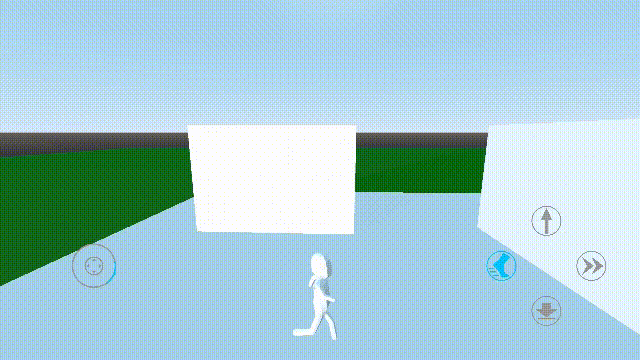

# Godot Third Person Player Controller
A third person player controller with touchscreen support for Godot.

This is a complementary code repository for my [YouTube video series](https://www.youtube.com/playlist?list=PLlT0CCZ8Yw0mcxG_D_sSA-Imnc5tiR4tx) and it gets updated with each new video I post.

This means that the master branch always contains the latest changes, and is in sync with my latest video. If you're interested in a subset of the features or the history of the project in tandem with the corresponding videos, you can view the repo at an older tag (e.g. tag [0.0.1](https://github.com/selgesel/godot-third-person-controller/tree/0.0.1) corresponds to [Video Part 1](https://www.youtube.com/watch?v=PQF2Zd5kKFQ), tag [0.0.2](https://github.com/selgesel/godot-third-person-controller/tree/0.0.2) to [Video Part 2](https://www.youtube.com/watch?v=Q41vo6luWsk) etc.).

For a list of changes you might want to see the [CHANGELOG.md](./CHANGELOG.md), and also the [Releases](https://github.com/selgesel/godot-third-person-controller/releases) page for each individual release (e.g. a new tag).

## Desktop Controls
| Keys | Action Name | Description |
|------|-------------|-------------|
| `W` | `move_forward` | Move character forward |
| `S` | `move_backwards` | Move character backwards |
| `A` | `move_left` | Move character to the left |
| `D` | `move_right` | Move character to the right |
| `Q` | `dash` | Have the character dash in their current movement direction (works both on the ground and mid-air) |
| `Shift` | `sprint` | Have the character run faster |
| `Ctrl` | `crouch` | Have the character crouch and move more slowly. While crouching the character can't jump or dash. |
| `Space` | `jump` | Have the character jump |
| `Esc` | `ui_cancel` | (Built-in) Toggle between captured and visible mouse modes |
| `Mouse Wheel Up` | `zoom_in` | Move the camera closer to the player |
| `Mouse Wheel Down` | `zoom_out` | Move the camera further away from the player |

## Touchscreen Gestures
| Gesture | Context | Description |
|---------|---------|-------------|
| Drag | Thumb Stick (Left) | Move the character around with a speed relative to drag distance |
| Drag | Screen | Rotate the camera |
| Press | Button (Right) | Have the character jump |
| Pinch In (Two Fingers) | Screen | Move the camera further away from the player |
| Pinch Out (Two Fingers) | Screen | Move the camera closer to the player |

## License
MIT

