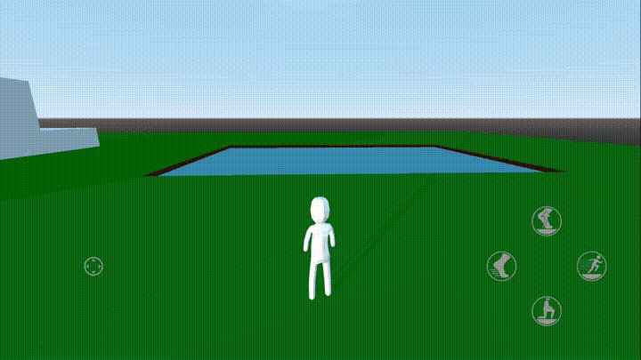

# Godot 3 - Third Person Player Controller
A third person player controller with touchscreen support for Godot 3.

> **Note:** This project is for Godot 3 only. For the Godot 4 version please see [selgesel/godot4-third-person-controller](https://github.com/selgesel/godot4-third-person-controller)

This is a complementary code repository for my [YouTube video series](https://www.youtube.com/playlist?list=PLlT0CCZ8Yw0mcxG_D_sSA-Imnc5tiR4tx) and it gets updated with each new video I post.

This means that the master branch always contains the latest changes, and is in sync with my latest video. If you're interested in a subset of the features or the history of the project in tandem with the corresponding videos, you can view the repo at an older tag (e.g. tag [0.0.1](https://github.com/selgesel/godot-third-person-controller/tree/0.0.1) corresponds to [Video Part 1](https://www.youtube.com/watch?v=PQF2Zd5kKFQ), tag [0.0.2](https://github.com/selgesel/godot-third-person-controller/tree/0.0.2) to [Video Part 2](https://www.youtube.com/watch?v=Q41vo6luWsk) etc.).

For a list of changes you might want to see the [CHANGELOG.md](./CHANGELOG.md), and also the [Releases](https://github.com/selgesel/godot-third-person-controller/releases) page for each individual release (e.g. a new tag).

## Desktop Controls
### Common Actions
| Keys | Action Name | Description |
|------|-------------|-------------|
| `W` | `move_forward` | Move/swim forward |
| `S` | `move_backwards` | Move/swim backwards |
| `A` | `move_left` | Move/swim to the left |
| `D` | `move_right` | Move/swim to the right |
| `Esc` | `ui_cancel` | (Built-in) Toggle between captured and visible mouse modes |
| `Mouse Wheel Up` | `zoom_in` | Move the camera closer to the player |
| `Mouse Wheel Down` | `zoom_out` | Move the camera further away from the player |

### When Not Swimming
| Keys | Action Name | Description |
|------|-------------|-------------|
| `Q` | `dash` | (Hold) Dash in the current movement direction. Hold to dash periodically |
| `Shift` | `sprint` | (Hold) Run faster |
| `Ctrl` | `crouch` | (Hold) Crouch. While crouching the player moves more slowly and can't jump or dash |
| `Space` | `jump` | Jump. The player can jump multiple times |

### When Swimming
When swimming underwater the movement direction is affected both by the horizontal and vertical angles of the camera. The player can only swim horizontally when on the water surface

| Keys | Action Name | Description |
|------|-------------|-------------|
| `Q` | `surge` | (Hold to charge) After charging for a brief duration, surge in the current movement direction |
| `Ctrl` | `swim_down` | (Hold) Swim downwards. When on surface, this forces the player to dive back in |
| `Space` | `swim_up` | (Hold) Swim upwards |
| `Space` | `jump` | (When on surface) Jump out of the water |

## Touchscreen Controls
In touchscreen devices some actions are performed through gestures, and some are performed simply by pressing the corresponding on-screen button.

Each button displays an icon that (hopefully) explains the action that they perform, and they also appear or disappear based on whether or not they're available.

### Gestures
| Gesture | Context | Description |
|---------|---------|-------------|
| Drag | Thumb Stick (Left) | Move/swim in the current look direction with a speed relative to the drag distance |
| Drag | Screen | Rotate the camera |
| Pinch In (Two Fingers) | Screen | Move the camera further away from the player |
| Pinch Out (Two Fingers) | Screen | Move the camera closer to the player |

## License
MIT
